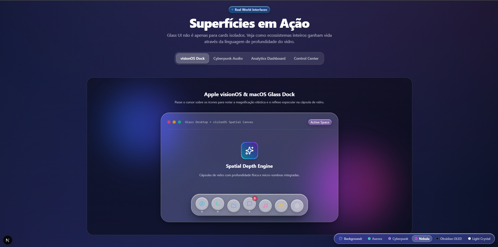

# Glass UI (@gadiegon/glass-ui)

> **Treating Glass as a Living Digital Material.**  
> The definitive, physics-driven Glassmorphism design system and component library for React and Next.js.



---

## ✨ Features

- 💎 **Physics-Driven Glass Engine**: Not a plain `backdrop-filter: blur(10px)`. Combines surface diffusion, specular edge highlights, internal caustics, and refractive luminosity.
- 🌈 **8 Distinct Material Presets**: `frosted`, `crystal`, `liquid`, `smoked`, `milky`, `iridescent`, `clear`, and `tinted`.
- 📐 **5-Tier Depth Elevation System (0 to 4)**: Calibrates blur, border contrast, elevation shadow, and specular alpha automatically.
- ⚡ **Interactive Dynamic Light Sheen**: Optical highlight tracking cursor coordinates over the glass surface in real time.
- 🎨 **Anti-Banding Micro-Noise**: Procedural SVG noise texture simulating genuine frosted glass tactility without external assets.
- 🚀 **Next.js 15 & React 19 Ready**: Full App Router support, `"use client"` where interactive, Server Component compatible where applicable.
- ♿ **Accessibility First**: Visible focus halos, high-contrast fallbacks, ARIA compliance, and `prefers-reduced-motion` detection.
- 📦 **Zero-Overhead & Tree-Shakable**: Built with clean ESM and TypeScript declarations.

---

## 📦 Installation

```bash
# pnpm
pnpm add @gadiegon/glass-ui

# npm
npm install @gadiegon/glass-ui

# yarn
yarn add @gadiegon/glass-ui
```

Import core styles in your root `layout.tsx` or `_app.tsx`:

```tsx
import '@gadiegon/glass-ui/styles.css';
```

---

## 🚀 Quickstart

Wrap your application or page in `GlassProvider`:

```tsx
import { GlassProvider, GlassCard, GlassButton } from '@gadiegon/glass-ui';

export default function App() {
  return (
    <GlassProvider theme="dark" defaultMaterial="crystal">
      <GlassCard depth={2} material="crystal" interactiveLight className="max-w-md p-6">
        <GlassCard.Header>
          <GlassCard.Title>Spatial Analytics</GlassCard.Title>
          <GlassCard.Description>Physical glass surface with live sheen</GlassCard.Description>
        </GlassCard.Header>

        <GlassCard.Content>
          <p>This card casts specular highlights based on cursor movement.</p>
        </GlassCard.Content>

        <GlassCard.Footer>
          <GlassButton variant="primary">Confirm Action</GlassButton>
        </GlassCard.Footer>
      </GlassCard>
    </GlassProvider>
  );
}
```

---

## 🔮 The `<Glass />` Primitive

The foundation of every component in the system.

```tsx
import { Glass } from '@gadiegon/glass-ui';

<Glass
  material="crystal"       // 'frosted' | 'crystal' | 'liquid' | 'smoked' | 'milky' | 'iridescent' | 'clear' | 'tinted'
  depth={2}                // 0 | 1 | 2 | 3 | 4
  blur={20}                // In pixels or 'none' | 'sm' | 'md' | 'lg' | 'xl'
  opacity={0.16}           // 0 to 1
  tint="blue"              // 'neutral' | 'slate' | 'blue' | 'purple' | 'emerald' | 'amber' | 'rose' | 'cyan'
  border="specular"        // 'none' | 'subtle' | 'specular' | 'glow'
  specular={true}          // Top edge light reflection
  interactiveLight={true}  // Dynamic sheen tracking mouse
  noise="subtle"           // false | 'subtle' | 'medium' | 'grainy'
  rounded="2xl"            // 'none' | 'sm' | 'md' | 'lg' | 'xl' | '2xl' | 'full'
>
  <div>Custom Glass Content</div>
</Glass>
```

---

## 🧩 Components Catalog

| Component | Description |
| :--- | :--- |
| `Glass` | Core physical surface primitive with optical layers |
| `GlassProvider` | Context provider for global theme, material presets, and motion |
| `GlassCard` | Composable card with `.Header`, `.Title`, `.Description`, `.Content`, `.Footer` |
| `GlassButton` | Tactile interactive button with spring depression and light sheen |
| `GlassIconButton` | Circular action button with glowing feedback |
| `GlassInput` | Text input with high-contrast backing and focus halo |
| `GlassTextarea` | Multiline glass text area |
| `GlassSwitch` | Smooth sliding toggle with elevated crystal pearl |
| `GlassSlider` | Touch/mouse slider with recessed track and elevated crystal thumb |
| `GlassBadge` | Translucent status pill with pulse indicator |
| `GlassAvatar` | Profile avatar with polished glass rim and status dot |
| `GlassTabs` | Navigation tabs with sliding glass active indicator |
| `GlassModal` | Depth 4 modal dialog with intelligent backdrop blur |
| `GlassDock` | Apple visionOS & macOS inspired floating dock with magnification |
| `GlassNavbar` | Sticky translucent navigation bar |
| `GlassAlert` | Luminous status banner with accent glow |
| `GlassDivider` | Ambient light divider line |

---

## 🛠️ Development

```bash
# Install dependencies
pnpm install

# Start documentation dev server
pnpm dev

# Build both @gadiegon/glass-ui and apps/docs
pnpm build

# Build library package only
pnpm build:pkg
```

---

## 📄 License

MIT © Glass UI Contributors
